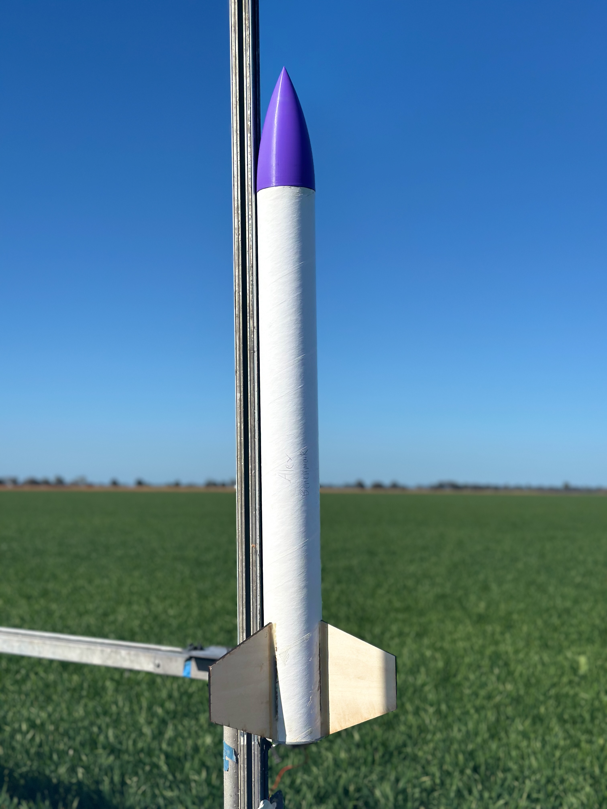
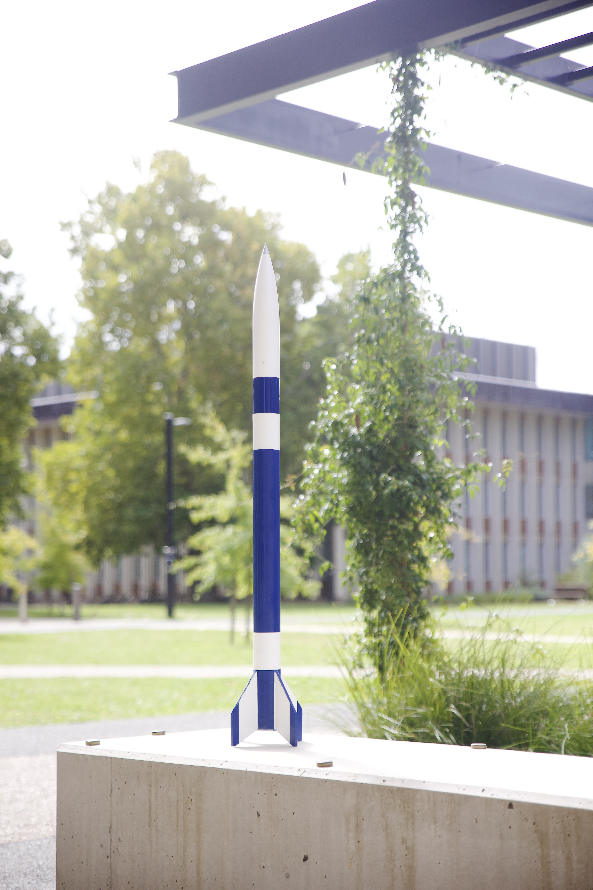
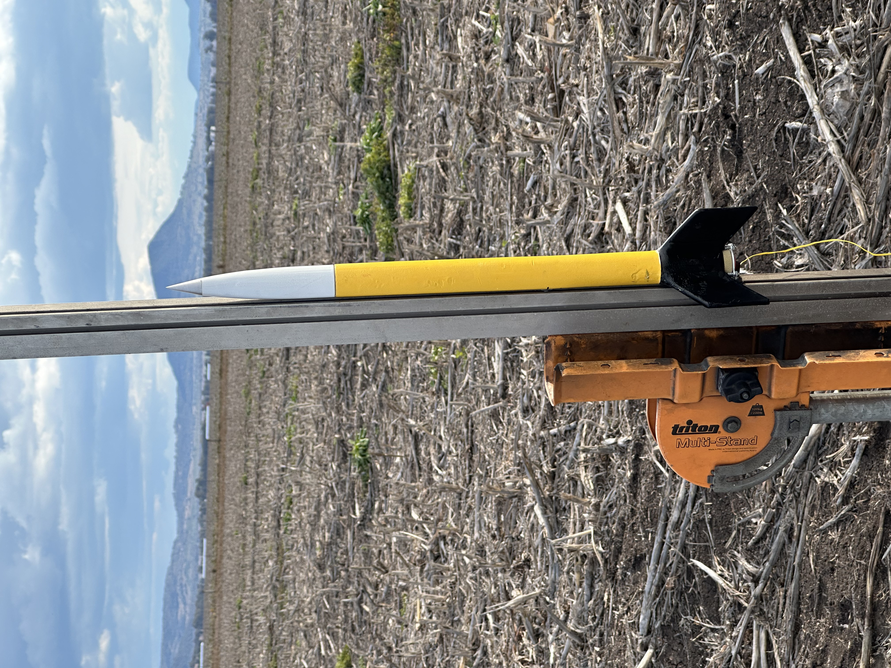
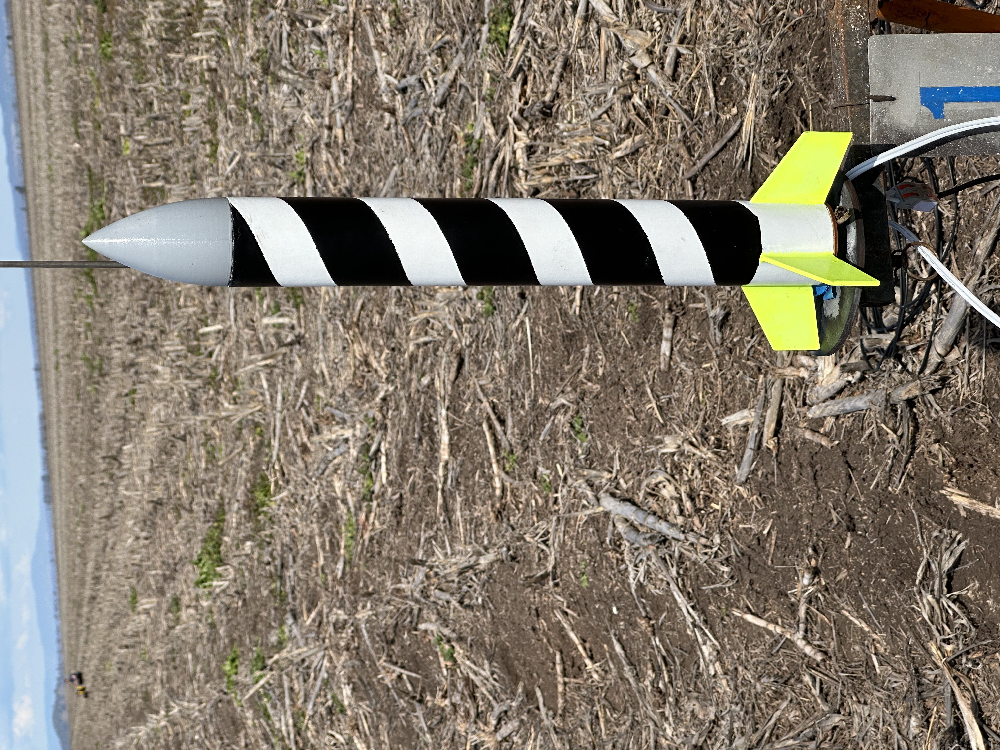

# Flight Log

**24 August 2025**  
Rocket: Benchmark  
Motor(s): AeroTech J425R   
Outcome: Success

**4 May 2025**  
Rocket: DSP (DualSeperationDePloyment, DigitalSignalProcessing)  
Motor(s): AeroTech J435WS   
Outcome: Flight report coming soon  

**10 August 2024**  
Rocket: ZOOOM  
Motor(s): AeroTech H128W  
Outcome: Success (nose cone tip lost)  

**10 August 2024**  
Rocket: MPR3  
Motor(s): Estes E16-6  
Outcome: Success  

**5 May 2024**  
Rocket: Project 40  
Motor(s): Estes F15-8 + Estes E16-6  
Outcome: Success  

**4 May 2024**  
Rocket: Project 40  
Motor(s): Estes E16-6  
Outcome: Success  

**21 April 2024**  
Rocket: Grass is Greener  
Motor(s): Estes F15-8  
Outcome: Rocket was not recovered (lost)  

**7 April 2024**  
Rocket: Pink+Yellow+White  
Motor(s): 3 x Estes C6-5  
Outcome: Success
